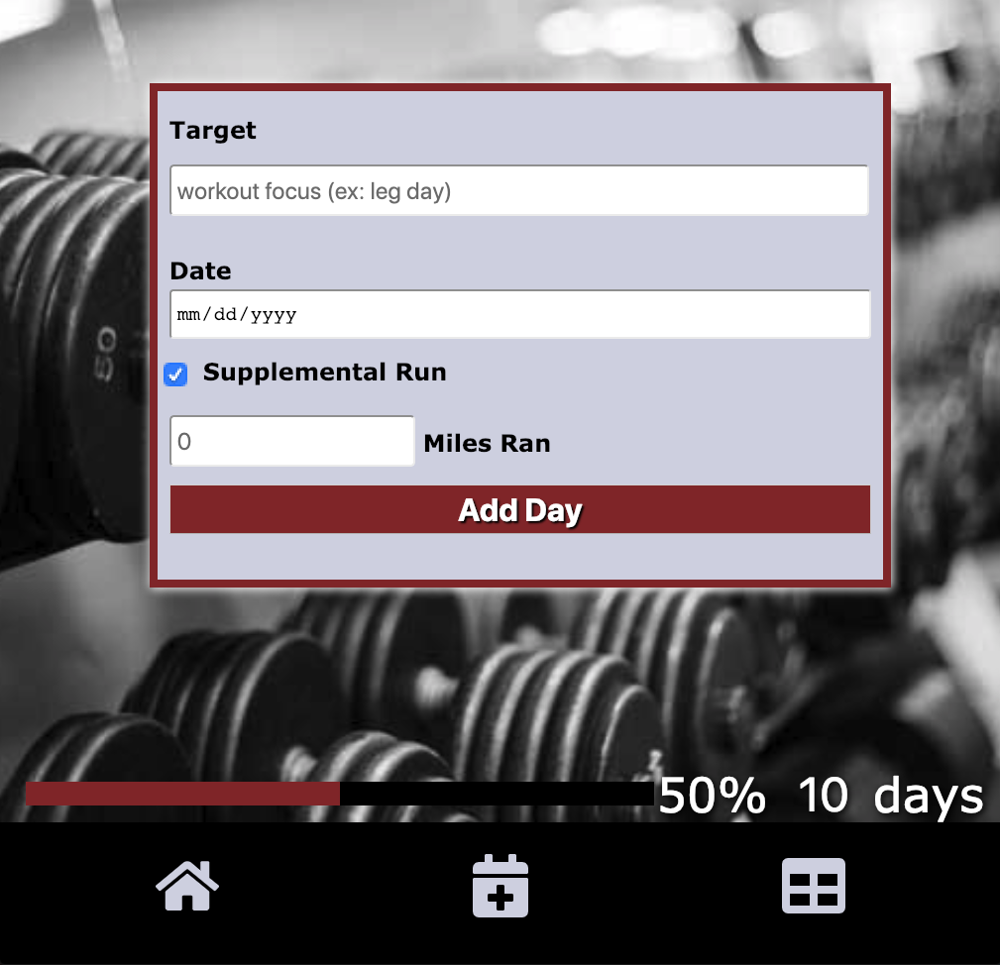

# Wokrkout Logger

## This is an app that logs information pertaining to your workout goals

## How to View Project
* Clone this repo
* In your terminal run `npm start`
* In another terminal window run `npm run suggestions`
* The project should be available to view at <http://localhost:3000>
      

